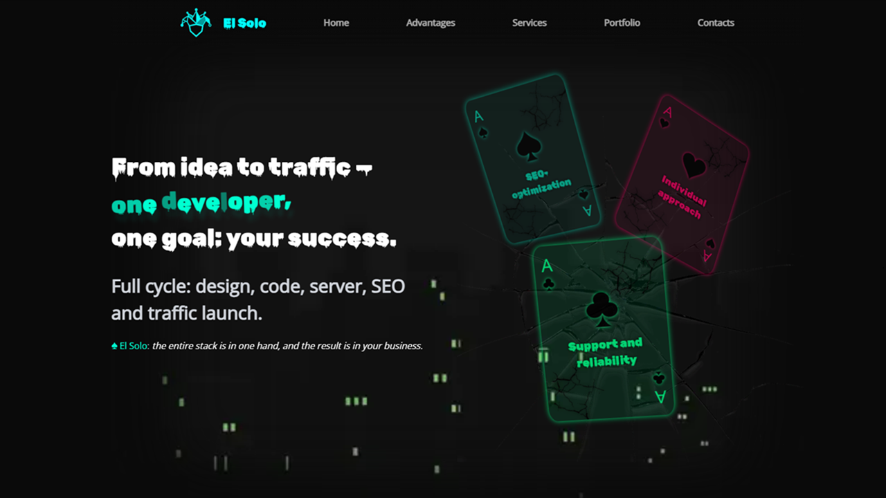

# El Solo 🃏

# Многоязычный сайт-визитка и платформа для привлечения потенциальных клиентов 👥



## ✨ Информация
- Главный экран приветсвия
- Секция с преимуществами
- Прайс-лист (с выпадающим диалоговым окном)
- Список моих работ
- Контакты

## 🛠 Технологии
- Фронтенд:
  - Next.js
  - TypeScript
  - Tailwind CSS
  - I18N (многоязычность)
  - Docker
  - SCSS (стили)

## ⚙️ Установка
1. Клонируйте репозиторий:
   ```bash
   git clone https://github.com/K-a-R-a-T-e-L-L/El-Solo
   cd El-Solo

2. Установка зависимостей:
   ```bash
   npm install

3. Запуск 
- Docker:
   ```bash
   docker build -t el-solo .
   docker run -p 3000:3000 el-solo
- Локально:
   ```bash
   npm run build
   npm start

## 📞 Контакты
   ● **Телеграм** — [@K_a_R_a_T_e_L_L](https://t.me/K_a_R_a_T_e_L_L)
   
   ● **Email** — kirillcuhorukov6@gmail.com
